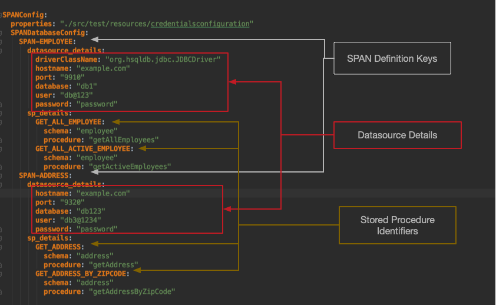

SPAN Framework
==============

### 1. About SPAN - Stored Procedure ANnotations

SPAN is a java framework which helps the developers to connect the
Stored Procedures (SP) by just providing the configuration and POJO
details:

-   No or minimal boilerplate code.

-   Autogenerated Input, Output and ResultSet POJOs eliminate chances of
    miss-match between Stored Procedure Definition and Java code.

-   Readable and Maintainable. 

The developer does not worry about underneath execution of the SP and
database syntax. 

### 2. How it works


##### 2.1.1. *Maven dependency*  

```maven
<dependency>
    <groupId>com.americanexpress.span</groupId>
    <artifactId>span</artifactId>
    <version>1.3.1</version>
</dependency>
```

##### 2.1.2. *Configuration*

Understanding configuration is key to work with SPAN framework.

Developer should provide configuration in a way that is supported by
SPAN. Refer the below section to understand the structure of SPAN
configuration file. 

SPAN follows either of the below approaches to read and load the
configuration file: 

1.  Developer creates the environment specific file which starts with
    **\"SPANConfig\"**. If needed, developer can specify app profile environment variable by 
    implementing PropertyConfiguration interface.

2.  Developer provides the file name by implementing PropertyConfiguration interface, and pass the object of the class which implements the interface to initialization class. 

Sample SPANConfig configuration file,

**SPANConfig.yaml**  

```yaml
SPANConfig:
    properties: "./src/test/resources/testcredentialsconfiguration"
    SPANDatabaseConfig:
      SPAN_EMPLOYEE:
        datasource_details:
          driverClassName: "org.hsqldb.jdbc.JDBCDriver"
          hostname: "example.com"
          port: "9910"
          database: "db1"
          user: "db2@123"
          password: "password"
        sp_details:
          GET_ALL_EMPLOYEE:
            schema: "employee"
            procedure: "getAllEmployees"
          GET_ALL_ACTIVE_EMPLOYEE:
            schema: "employee"
            procedure: "getActiveEmployees"
      SPAN_ADDRESS:
        datasource_details:
          hostname: "example.com"
          port: "9320"
          database: "db2"
          user: "db2@1234"
          password: "password"
        sp_details:
          GET_ADDRESS:
            schema: "address"
            procedure: "getAddress"
          GET_ADDRESS_BY_ZIPCODE:
            schema: "address"
            procedure: "getAddressByZipCode"
```

Let\'s understand the configuration,

###### _SPAN works on following keys and sections_
-   **SPANConfig** : This is root element. Developer should declare in each SPAN configuration file. 
-   **properties** : It is optional element. SPAN will evaluate expression by looking into given properties file. It can have any key=value pair. For example, database Credentials.  
-   **SPAN Definition Key** : This key is identifier for
    single datasource and all of its associated Stored Procedure(s).
    From the above configuration, _SPAN_EMPLOYEE &
    SPAN_ADDRESS_ are SPAN definition keys. Developer should
    provide a unique key name. 

    -   **datasource\_details** :- This section will contain Datasource
        information, such as driverClassName ( Optional attribute and By default it's support IBM driver) hostname, port, database, user and
        password.

    -   **Password** : Developer can provide the password value in four ways.
        -   **Plain text**
        -   **Password as an environment variable**:- In some cases, we
            need to have our password in the environment variable.

              `
              Syntax will be - password: "${<Environment_variable>}". Example - password: "${MF_DB_PASSWORD}". SPAN will read the password from "MF_DB_PASSWORD" environment variables.
              `
        -   **Plain encrypted password**. - The developer can generate the
            encrypted password using SPAN framework. SPAN is supported
            **Jasypt** framework using **AES256** encryption methodology.
            Encrypted key can generated by calling SPAN framework\'s 
            _*EncryptionUtility.encrypt()_ *

            `
             Syntax will be - password: "ENC(expressionValue)" e.g. password: "ENC(3EzKQzJp7rhBU/A875mxKh6Vt7tCpZrk+umn7IOBjqWb6wo9NWs+lVtA7OCHNKER)
            `

        -   **Encrypted password from environment variable** :- Developer can
            encrypt the password using SPAN and pass it as environment variable.
    
            `
              Syntax will be - passwor- "ENC(${<Environment_variable>})" . e.g. password : "ENC(${ENCRYPTED_MF_DB_PASSWORD})"
            `

-   **sp\_details :** This section will have information about all
    Stored Procedures associated *SPAN Definition Key*. Each Stored
    Procedure is identified by a unique **Stored Procedure
    Identifier**. 

    -   **Stored Procedure Identifier Key**: In the above example, 
        **GET_ALL_EMPLOYEE, GET_ALL_ACTIVE_EMPLOYEE, GET_ADDRESS, and
        GET_ADDRESS** are user define the keys. This key should
        contain following sub keys. 

        -   **schema:** This will represent the name of the database
            schema. e.g. employee, address.

        -   **procedure:** This will represent the  Stored Procedure
            name of the database. e.g. getAllEmployees, getActiveEmployees, getAddress,
            getAddressByZipCode.




##### 2.1.3. SPAN Input and Output - Plain Old Java Object ( POJO )

Now, SPAN framework requires POJOs for the Stored Procedure Input,
Output and ResultSet. 

SPAN has ***Field*** annotation. Each member variable of the POJO should
be annotated with @**Field**. 

Each Stored Procedure may have Input Parameters, Output parameters
and/or ResultSet(s). 

##### 2.1.3.1. Field Annotation

Field annotation helps SPAN identify Input parameters, OutputParameters
and ResultSet fields. 

Field annotation can have three parameters: 

Parameter Name | Required | Description
------------ | ------------- | -------------
name | True | Parameter name of the SP Input , Output or column name of the ResultSet.
default\_value | False | Developer can provide default value. This will only be considered when the corresponding object value is not present.
transformationClass | False |Developer can override the default transformation logic by creating custom class. Default transformation logic will do the best possible effort to convert the database object to the type of the field ( or vice versa ).

Let\'s see an example,

##### 2.1.3.2. ResultSet Annotation

ResultSet annotation helps SPAN identify POJO mapped to the ResultSet
returned from Stored Procedure. It\'s a field level annotation. 

ResultSet annotation can have one parameter: 

Parameter Name | Required | Description
------------ | ------------- | -------------
seqNum | false |Default value is 1. This is required when Stored Procedure is returning more than one ResultSet.

##### 2.1.3.3. Stored Procedure Input POJO

Stored Procedure Input POJO defines Stored Procedure Input Parameters.

At runtime, SPAN looks at  Field annotation, extracts name & object\'s
value and sets as Stored Procedure Input param.

```JAVA

public class SPInput {
 
    @Field(name = "I_EMPLOYEE_ID", default_value = " ")
    private String employeeId;
 
    @Field(name = "I_DEPT_ID", default_value = " ")
    private String deptId;
 
    //The FieldTransformationImpl class will convert Date into String which is required for the SP
    @Field(name = "I_START_DATE", transformationClass = DateToStringTransformationImpl.class)
    private Date startDate;
 
    //The FieldTransformationImpl class will convert Date into String which is required for the SP
    @Field(name = "I_END_DATE", transformationClass = DateToStringTransformationImpl.class)
    private Date endDate;
 
}
```

##### 2.1.3.4.  Stored Procedure Output POJO

Stored Procedure Output POJO defines Stored Procedure Output Parameters
and reference to ResultSet POJO(s).

At runtime, SPAN looks at  Field annotation, extracts name, gets the
corresponding database parameter value and sets as value of the member
variable of the POJO. This POJO may have reference of the ResultSet(s) -
Using *\@ResultSet* annotation.

For Example,

```java
public class SPOutput {

    @Field(name = "O_RET_CODE", transformationClass = StringToEnumTransformationImpl.class)
    private ResponseEnum returnCode;
 
    @Field(name = "O_RET_DESC" )
    private String returnDesc;
 
    @Field(name = "O_EXPL_CODE")
    private String explCode;
 
    @Field(name = "O_EXPL_DESC")
    private String explDesc;
 
    @ResultSet
    private List<ResultSetData> resultSetClassList;

}
```
##### 2.1.3.5. ResultSet POJO

Stored Procedure may return one or more ResultSets. 

ResultSet POJO defines all the columns of the ResultSet returned by
Stored Procedure.

At runtime, SPAN looks at Field annotation, extracts name, gets the
corresponding Resultset column value and sets this value as the member
variable of the POJO. 

For Example,

**ResultSet Pojo**

```java
/*
ResultSetData.class have all the required member variables and
they are annotated with \@Field, the name should exactly match the SP
column name.
*/
public class ResultSetData {

    @Field(name = "O_EMPLOYEE_ID")
    private String employeeID;
 
    @Field(name = "O_EMPLOYEE_NAME")
    private String employeeName;

}
```
Developer should refer ResultSet POJO from SPOutput POJO as described
below :

```
@ResultSet
private List<ResultSetData> resultSetClassList;
```
##### 2.1.3.6.  Transformation

Developer can override the default transformation logic by creating
custom class. Default transformation logic will do the best possible
effort to convert the database object to the type of the field ( or vice
versa ).

Below example describe transformation logic for transform String error
code to ErrorEnum:

```java
public class StringToEnumTransformationImpl implements FieldTransformation<ResponseEnum> {
     
    /**
     * Transforms String to Enum
     */
    @Override
    public ResponseEnum transform(final Object fieldValue, final Class<ResponseEnum> targetClass) {
        if ("0000".equals(fieldValue)) {
            return ResponseEnum.SUCCESS;
        }
        return ResponseEnum.ERROR;
    }
}
```

##### 2.1.4. *Putting it all together*

Based on the *Stored Procedure Identifier* key, the SPAN framework pulls
the Datasource and Stored Procedure details from the configuration
file. 

Below example shows how to execute a Stored Procedure using SPAN
framework:

**SpExecutor**

```java
public class SPExecution {
 
    public static void main(String[] args) {
 
        try {
 
            //Initializing and loading the SPAN configuration
            SPANInitialization.initialize();
 
            //Setting up the SP Input Params
            SPInput spInput = new SPInput();
            spInput.setEmployeeId("EMP00010");
            DateFormat formatter = new SimpleDateFormat("yyyy-MM-dd");
            //Setting Date and the FieldTransformationImpl->DateToStringTransformationImpl class will take care of formatting Date into String.
            spInput.setStartDate(formatter.parse("2018-01-01"));
            spInput.setEndDate(formatter.parse("2019-07-25"));;
 
            //Initializing and Invoking the SPAN SP Executor
            SPExecutor spExecutor = new SPExecutor();
            SPOutput outParams = spExecutor.execute("GET_ALL_EMPLOYEE", spInput, SPOutput.class);
 
            System.out.println("================ SP Results - Start ===============");
            System.out.println("ExplCode :- " + outParams.getExplCode());
            System.out.println("ExplDesc :- " + outParams.getExplDesc());
            System.out.println("ReturnCode :- " + outParams.getReturnCode());
            System.out.println("ReturnDesc :- " + outParams.getReturnDesc());
            System.out.println("ResultSet Size :- " + outParams.getResultSetClassList().size());
 
            //Iterating the result set
            outParams.getResultSetClassList().stream().forEach(resultSetObj -> {
 
                System.out.println("O_EMPLOYEE_ID : " + resultSetObj.getEmployeeID());
                System.out.println("O_EMPLOYEE_NAME :" + resultSetObj.getEmployeeName());
 
            });
            System.out.println("================ SP Results - End ===============");
 
        } catch (SQLException e) {
            System.out.println("EXCEPTION " + e.getMessage());
            e.printStackTrace();
        }
    }
}
```

Let's understand the code, 

-   **SPANInitialization.initialize** :- Should be called only once per
    JVM.

-   User should create an instance of the SPInput class and set
    appropriate values.

-   Below is sample code to execute Stored Procedure,

```
SPExecutor spExecutor = new SPExecutor(); // create a object
SPOutput outParams = spExecutor.execute("GET_ALL_EMPLOYEE", spInput, SPOutput.class); // call the execute method         
```
*SPExecutor.execute* method has three parameters.

-   **Stored Procedure Identifier Key** - This is used to identify
    Stored Procedure from SPAN configuration file. 

-   **spInput** :- Instance of Store-Procedure Input POJO.

-   **returnType** :- Class reference of Stored Procedure Output POJO. 

This execution will return the instance of \"returnType\" containing
OutPut Parameters and ResultSet(s).

### 3. Auto Generation - DAO Layer ( Database model/POJO And DAO classes.)
This framework can generate a Database model/POJO and DAO classes. So the developer does not need to worry about
to create Stored Procedure POJO for Input, Output, and ResultSet classes and also a sample code to execute the Stored Procedure.
The auto-generation process also created a sample project in which you import any IDE and can run it.  

It is two steps process,

1. Please go to the SPAN root directory.
2. Please create the SPANConfig.yaml file, please see the above section - 2.1.2. *Configuration*.
3. Now, execute the below script,
The syntax of the script - 
```
./GenerateSPInputOutput.sh <SPANConfigFileName> <Stored Proc Id in SPANConfigFile> <packageName>
```
For example, 
```
./GenerateSPInputOutput.sh SPANConfig.yaml GET_ALL_EMPLOYEE com.test
```
- This script has three parameters.
    1. SPANConfiguration file which contains information about the database and Stored Procedure.
    2. Stored Procedure Identifier from the configuration. For example, GET_ALL_EMPLOYEE, GET_ALL_ACTIVE_EMPLOYEE.
    3. Java Package to store SPAN related files.     

This process will identify what are the Input and Output parameters of the Stored Procedure and it will create
two Java files and one input file for the generating the ResultSet java file. 
    1. SPInput.java 
    2. SPOutput.java
    3. <SP_Identifier>.input
     
Generated Java files have a reference of the Stored Procedure parameters with SPAN annotation & java variable name. 
But it will not create a Result because to generate the ResultSet, SPAN needs some values against each Input parameters. 
Please give appropriate values into <SP_Identifier>.input generated file.

Additionally, this script will tell you what you need to do next.

4. Now, we need to generate ResultSet java file with the help of the <SP_Identifier>.input file.

The syntax of the script - 
```
./GenerateSPResultSet.sh <SPANConfigFileName> <Stored Proc Id in SPANConfigFile> <packageName>
```
For example, 
```
./GenerateSPResultSet.sh  SPANConfig <SP_Identifier>.input com.test
```
This command will execute SP and then generate the ResultSet java file. Along with that, it will create a new ResultSet variable into the SPOutput.java file.

Also, the script output will tell you what you need to do to execute the Stored Procedure from java file. 

Additionally, it will a create sample project where you can import as project into your IDE and execute `main` method of the Main.java file. It will initialize
the SPAN framework and call the SP and display the ResultSet values. 

#### 4.  Benefits 


-   SPAN will reduce significant development time as it has a minimum configuration and code change.

-   Already tested and hardened code.

-   Support all RDBMS databases, tested for Db2, Postgres. 

-   Manage the datasource resource including **password encryption** in
    order to reduce Developer\'s overhead. 

-   Autogenerated Utility to generate Input, Output and ResultSet
    object. 

#### 5.  Key Points


-   Inner Source Ready - Well Documented, 105 unit/component test cases
    to support extensibility, code coverage is more than 90%. 

-   Compatible with the Java 8 and newer version.

## Contributing

We welcome Your interest in the American Express Open Source Community on Github. Any Contributor to
any Open Source Project managed by the American Express Open Source Community must accept and sign
an Agreement indicating agreement to the terms below. Except for the rights granted in this 
Agreement to American Express and to recipients of software distributed by American Express, You
reserve all right, title, and interest, if any, in and to Your Contributions. Please
[fill out the Agreement](https://cla-assistant.io/americanexpress/SPAN).

## License

Any contributions made under this project will be governed by the
[Apache License 2.0](./LICENSE.txt).


## Code of Conduct

This project adheres to the [American Express Community Guidelines](./CODE_OF_CONDUCT.md). By
participating, you are expected to honor these guidelines.